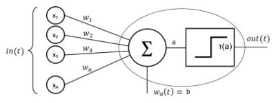

# *Perceptron*

Our ultimate goal is to mathematically formulate a MLP, however there is a simple type of neural network that will help you to build the foundation to understand MLPs. If you think you already comfortable with this concept, you might want to skip to [MLP](https://github.com/filipecalasans/mlp)

# Preamble 

You may be asking yourself: why do we need another Perceptron/MLP explanation in the internet? This repository provides my thought process after reading several materials when I tried to implement a MLP myself. At the time, I was able to understand and implement it only after a lot of reading, and trial and error. So, as I felt the necessity to be exposed to different ways of explaining the same topic, I think others may face the same situation.

Hope this document can help you on your learning journey. Good Luck !

# Mathematical Formulation

*Perceptron* is single neuron Neural Network(NN) as shown in the picture bellow.

 <p align="center"> 
    
 </p>

Mathematically speaking, this neuron produces the following output:

<p align="center"></p>

In other words, the output of a neuron is given by a linear combination of its inputs:

<p align="center"></p>

Adjusted by an offset, called baias, which produces the output :

<p align="center"></p>

Then, the final output is calculated passing  as argument of the function denominated **Activation Function**:

<p align="center"></p>

If you remind of Linear Algebra, the equation *(2)* looks like the hyperplane equation . Indeed it is a hyperplane. Moreover, the equation give us a notion of how far the data vector  is from the hyperplane:

<p align="center"></p>

Using *Perceptron*, we can create a classifier that given an example characterized by the input , it returns if the example is **Class** **A = 0** or **B = 1**, using as decisive factor how far the point is from the hyperplane. If you noticed, this is the role of the **Activation Function** in the equation . In the image,you can notice that the function used is a step function, but we'll see later there are better **Activation Functions** that we can use.

The step function is given by . This is how we would classify our examples mathematically.

### Now, you should be wondering: How does perceptron "learns" the best hyperplane? 

Indeed, the challenge in Machine Learning is: how do algorithms "learn"?The *Perceptron* classifier is a *supervised learning algorithm*, therefore we must provide a set or examples beforehand, from which it will calculate the best possible hyperplane that separates the examples into two different classes. As you noticed, a single neuron is capable of classifying only two classes. Another characteristic of the *Perceptron* is that it works well only with linearly separable datasets.

Two sets of points are said to be linear separable if there is at least one hyperplane that can separate them in two classes. In two dimensional spaces, you can think as a line that can separate the points on a plane on two different sides. You can read more in [Linear separability - Wikepedia.](https://en.wikipedia.org/wiki/Linear_separability)


## Stochastic Gradient Descent (SGD) - How NNs Learn

Neural Networks, including *Perceptron* and *MLP*, apply the method *Stochastic Gradient Descent (SGD)* on their learning process. SGD is an iterative method for optimizing a differentiable objective function, a stochastic approximation of gradient descent optimization. You can find a more formal explanation in [Wikepedia](https://en.wikipedia.org/wiki/Stochastic_gradient_descent).

It may sound confusing, even intimidating. But don't worry we'll get there.

Simplifying, SGD is an algorithm to estimate an unknown function. SGD comes from optimization field. In optimization, the ultimate goal is to estimate a function trying to minimize the *Cost function*, which is the measure of how far we are from our goal. If you have ever studied optimization problems, that might sound familiar to you.

The concept of *Cost Function* is also applicable to NNs. It  mathematically represents how far we are from the ultimate goal. The ultimate goal in Classification problems is to classify the training examples correctly.

Let's make a hypothetical experiment. Let's say we have a data set with 10 examples, given by: 

<p align="center"></p>

where,  is the input and *Y* is the correct class for the example. Now, we randomly generate a set of initial weights  and bias . We should be able to describe how far we are from classifying the examples correctly, so we can take the best action to improve our classifier. That is the point that **Cost Function** comes in handy. One very popular **Cost Function** is the quadratic error difference, given by:

<p align="center"></p>

This formula tells that for a given set of wights and biases , the cost is the square of the distance between the right classification  and the estimated classification . On 1-dimensional classifiers, such as *Perceptron*, the distance is simply the squared difference; On N-dimensional problems the cost is the squared module of the vectorial distance between the vector  and .

In this context, SGD is a method to update  interactively towards one of the minimum of the function * hopping that it will turn our classifier better, or it will converge towards a minimum. SGD defines the following two update equations, also called in this article learning equations:

<p align="center"></p>

<p align="center"></p>

These two equations tell that every interaction of the algorithm we must update the weights and biases by a fraction ** of the partial derivative, but in the opposite direction. That makes  to advance towards a local minimum. It turns out that a function can have multiples minimums, and depending of the initial values we may be trapped on a local minimum, instead of a global one. There are some techniques to mitigate that, however it is beyond the scope of this article.

## Formulating the Perceptron

Let's apply what ye have discussed so far to formulate the *Perceptron*.

<p align="center"></p>

<p align="center"></p>

*Perceptrons* have uni-dimensional output, so we are going to skip the vectorial notation. Re-wrinting it, we have:

<p align="center"></p>

Learning Equations:

<p align="center"></p>

<p align="center"></p>

The key part to understand the next step is to remember the **Chain Rule Derivative**, which is given by:

<p align="center"></p>

Applying  in , we have:

<p align="center"></p>

Let's call the derivative :

<p align="center"></p>

If you notice, we have written  on a way that it is evident the **Chain Rule**.

Let's call .

Applying the **Chain Rule**, we have:

<p align="center"></p>

Notice that  is constant, therefore its derivatives regarding , and  are zero.

Finally, we can update the Learning Equation  to:

<p align="center"></p>

Do you remember that SGD requires a differentiable objective function? Now, you can understand why. As you must have noticed, SGD depends on both **Cost Function** and **Activation Function** derivatives. That is
the reason why we do not utilize the step function as **Cost Function**. Since it has a singularity on  we have no way to calculate the derivatives on several points of the space.

Applying the same approach, we can deduce the learning equation for .

<p align="center"></p>

Remember:

<p align="center"></p>

Therefore,

<p align="center"></p>

We have now the two Learning Equations that we can use to implement the algorithm:

<p align="center"></p>

<p align="center"></p>

## Choosing the Activation Function

We are interested on finding an **Activation Function** that looks like a step function, but at the same time is continuous and differentiable in . Sigmoid, also called logistic function, is one of the widely used functions due to having these properties.

Sigmoid function is given by:

<p align="center"></p>

With the following derivative:

<p align="center"></p>

NOTE: The sigmoid is easily differentiable using **Chain Rule**, this is also one of the reasons for its popularity. You can google it if you are curious how to calculate the derivative.

## Notes on Matrix Representation

The aspect that I had difficult the most when I tried to implement NNs in Python was to translate the equations to matrix representation. Sure, we could iterate over each index and calculate one weight per iteration. However, we would be limiting ourself. The main reason we should use matrix representation is because the numeric libraries are optimized for matrix representation. Moreover, they try to take advantage of hardware optimization when possible.

Let's re-write the equations we have learned so far on matrix representation. First we will work with a particular example , so you can visualize the dimensions, then we will write the algebraic notation generalizing this particular case.

<p align="center"></p>

Output  of the Neuron is given by:

<p align="center"></p>

<p align="center"></p>

After applying the **Activation Function**, we have:
<p align="center"></p>

<p align="center"></p>

Notice, from vectorial calculus that:

<p align="center"></p>

The Learning Equations can be re-written as:

<p align="center"></p>


<p align="center"></p>

<p align="center"></p>

<p align="center"></p>

## Implementation

We are going to use the library *Numpy* to implement matrix operation in *Python*.

### Implementation details

We are going also to use a slightly different activation function, in order to our example to converge.

```py
def f_sigmoid(x):
    """The sigmoid function."""
    return 10.0/(10.0+math.exp(-x))

def df_sigmoid(x):
    """Derivative of the sigmoid function."""
    return f_sigmoid(x)*(10.0-f_sigmoid(x))
```

We define a class *Perceptron* with the following parameters:

```py
class Percepetron:
    
  def __init__(self, input_size, eta=0.01, threshold=1e-3):
    """
      Generate the random initial weights
    """
    self.w = np.random.uniform([-1, 1, input_size+1])
    self.fnet = np.vectorize(f_sigmoid)
    self.dfnet = np.vectorize(df_sigmoid) 
    self.eta = eta
    # Minimum error before stopping training
    self.threshold = threshold
    # Current squarer of error
    self.sqerror = 0
```

Notice that we generate a initial set of random weights in the interval . We also store the weights and bais in the same array, in order to optimize calculation. The array  is given by . Additionally, we also utilize the function *vectorize* in *numpy* to call the functions *fnet* and *dfnet* for each element in the vector.

```py
class Percepetron:

   """
      ...
   """

    def apply_learning_equation(self, dataset):
    """
      Training Equations
      w_1(t+1) = w_1(t) + 2*eta*(y-sigma(net))*sigma'_{w1}(net)
      w_2(t+1) = w_2(t) + 2*eta*(y-sigma(net))*sigma'_{w2}(net)
      b(t+1) = b(t) + 2*eta*(y-sigma(net))
      sigma(net) = fnet(net)
      sigma'(net) = dfnet(net)
    """
    col = dataset.shape[0]

    # dataset = [x1, x2, ..., xn, Y]
    # x = [x1, x2, ..., xn, 1]
    # y = [Y]
    x = np.append(dataset[:-1], 1)
    y = dataset[-1]

    # Transpose X, Y
    x = x.T
    y = y.T

    net = np.matmul(self.w, x)

    y_o = self.fnet(net)
    error = y - y_o
    
    self.sqerror += np.linalg.norm(error)**2
    delta = 2*error*self.dfnet(x)

    self.w[:-1] += (2.0*self.eta*delta[:-1])
    self.w[-1] += (2.0*self.eta*error)
```

The function *apply_learning_equation* receives as argument an example from the dataset, where . Next we update the weights and bias. This step is repeated until the
minimum error or the maximum number of iterations is reached. We also keep monitoring the square error to know if the training is converging.

```py
def train(self, dataset):
    
    print("Training ...")

    # dataset = [ [x1_1, x1_2, ..., x1_n, y1],
    #             [x2_1, x2_2, ..., x2_n, y2], 
    #             ...
    n = dataset.shape[0]
    iteration = 0

    while True:
      iteration += 1
      self.sqerror = 0.0
      np.apply_along_axis(self.apply_learning_equation, axis=1, arr=dataset)
      if (self.sqerror/n) < self.threshold:
        break
      if iteration > 50000:
         break
```

## Example

We are going to validate our implementation training the Perceptron to learn the logic *OR*. The examples are provided in the file **OR.dat**.

```py
def train_and_test_and(filename):

  dataset = np.loadtxt(open(filename, "rb"), delimiter=" ")
  
  print("DataSet: {}".format(dataset))
  dimension = dataset.shape[1]

  p = Percepetron(dimension)
  p.train(dataset)

  a = 0
  b = 0
  print("{} OR {}: {}".format(a,b, p.test(np.array([a, b]))))

  a = 0
  b = 1
  print("{} OR {}: {}".format(a,b, p.test(np.array([a, b]))))

  a = 1
  b = 0
  print("{} OR {}: {}".format(a,b, p.test(np.array([a, b]))))

  a = 1
  b = 1
  print("{} OR {}: {}".format(a,b, p.test(np.array([a, b]))))

if __name__ == "__main__":
  train_and_test_and("OR.dat")
```

You can try to train using different datasets as a challenge. We provide the logic *AND* in the file **AND.dat**. But, bear in mind that the dataset must be linearly separable. 

**Challenge 1:** Try to train the *Perceptron* to learn the logic *XOR* and verify if the dataset is linearly separable.

**Challenge 2:** Tune the parameters in the *Activation Function* and *eta*, so the training converges faster.
