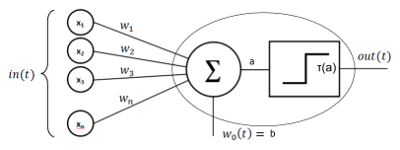

# *Perceptron*

Our ultimate goal is to mathematically formulate a MLP, however there is a simple type of neural network that will help you to build the foundation to understand MLPs. If you think you already comfortable with this concept, you might want to skip to [MLP](https://github.com/filipecalasans/mlp)

# Preamble 

You may be asking yourself: why do we need another MLP explanation in the internet? This repository  provides my thought process after reading several materials when I tried to implement a MLP by myself. At the time, I could understand and implement it only after a lot of reading, and trial and error. So, as I felt the necessity to read different points of views and be exposed to different ways of explaining the same topic, I think others may face the same situation.

Hope this document can help you on your learning journey. Good Luck !

# Mathematical Formulation

MLPs are composed by mathematical neurons and its synapses, in this case called weights. Neurons are arranged in layers, and connected between them through weights. The simplest MLP you can build is composed of three layers: Input, Hidden and Output layers. In the classical topology each neuron of a given layer is fully connected with the neurons of the next layer. 

## *Perceptron*

Our ultimate goal is to mathematically formulate  a MLP, however there is a simple type of neural network that will help you to build the foundation to understand MLPs. If you think you arready comfortable with this concept you might want to skip to [MLP](https://github.com/filipecalasans/mlp)

*Perceptron* is single neuron NN as shown in picture bellow.  

The picture bellow shows a *Perceptron* and its different mathematical components:

 
 
    
 

Mathematically speaking, this neuron produces the following output:

\begin{equation*}
$out(t) = tau( \sum_{i=1}^{n} w_{i}*x_{i} + b )$
\end{equation*}

In other words, the output of a neuron is given by a linear combination of its inputs:

\begin{equation*}
$\sum_{i=1}^{n} w_{i}*x_{i} :(1)$
\end{equation*}

Adjusted by an offset, called baias, which give us output **a**:

\begin{equation*}
$a = \sum_{i=1}^{n} w_{i}*x_{i} + b :(2)$
\end{equation*}

Then, the output is calculated passing the input to a function denominated **Activation Function**:

\begin{equation*}
$z = out(t) = \tau(a) :(3)$
\end{equation*}

If you remind of Linear Algebra, the equation *(2)* looks very similar to a hyperplane. Moreover, the equation 
give us a notion of how far the data sample $X<x1,x2,x3,...,xn>$ is from the hyperplane:

\begin{equation*}
$\sum_{i=1}^{n} w_{i}*x_{i} + b = 0 :(4)$
\end{equation*}

Using *Perceptron*, we can create a classifier that given an example characterized by the input $X<x1,x2,x3,...,xn>$, it returns if the example is **Class** **A = 0** or **B = 1**, using as decisive factor how far the point is from the hyperplane. If you noticed, this is the role of the **Activation Function** in the equation *(3)*. In this case, the example shows the step function, but as I'll show you later there are better **Activation Functions** that we can use.

### Now, you should be wondering: How does perceptron "learns" the best hyperplane? 

Indeed, the challenge in Machine Learning is: how do algorithms "learn"?The *Perceptron* classifier is a *supervised learning algorithm*, therefore we must provide a set or examples beforehand, from which it will calculate the best possible hyperplane that separates the examples into two different classes. As you noticed, a single neuron is capable of classifying only two classes. Another characteristic of the *Perceptron* is that, it works well only with linearly separable datasets.

Two sets of points are said to be linear separable if there is at least one hyperplane that can separate them in two classes. In two dimensional spaces, you can think as a line that can separate the points on a plane on two different sides. You can read more in [Linear separability - Wikepedia.](https://en.wikipedia.org/wiki/Linear_separability)

## Stochastic Gradient Descent (SGD) - How NNs Learn

Neural Networks, including *Perceptron* and *MLP*, apply the method *Stochastic Gradient Descent (SGD)*  on their learning process. SGD is an iterative method for optimizing a differentiable objective function, a stochastic approximation of gradient descent optimization. You can find a more formal explanation in [Wikepedia](https://en.wikipedia.org/wiki/Stochastic_gradient_descent).

It may sound confusing, even intimidating. But don't worry we'll get there.

Simplifying, SGD is an algorithm to estimate a unknown function trying to reach its minimum.
SGD comes from optimization field. In optimization, the ultimate goal is to estimate a function trying to minimize the *Cost function*, which is the measure of how far we are from the goal. If you have ever studied optimization problems, that might sounded familiar.

The concept of *Cost Function* is also applicable to NNs. It  mathematically represents how far we are from the ultimate goal. The ultimate goal in Classification problems is to define how far we are of classifying the training examples correctly.

Let's make a hypothetical experiment. Let's say we have a data set with 10 examples, given by: 

\begin{equation*}
$Xi = <x1, x2, x3, ...., Xn, Y> :(5)$
\end{equation*}

where, $<x1, x2, x3, ...., Xn>$ is the input and *Y* is the correct class for the example. Now, we randomly generates a set of initial weights $<w1, w2, w3, ..., wn>$ and biases $<b1, b2, b3,..., bn>$. We should be able to describe how far we are from classifying the examples correctly, so we can take the best action to improve our classifier. That is the point that **Cost Function** comes in handy. One very popular **Cost Function** is the quadratic error difference, given by:

\begin{equation*}
$C(w, b) = \|\|Y -Ŷ\|\|^2 :(4)$
\end{equation*}

This formula tells that for a given set of wights and biases $(w,b)$, the cost is the square of the distance between the right classification $Y$ and the estimated classification $Ŷ$. On 1-dimensional classifiers, such as *Perceptron*, the distance is simply the difference; On N-dimensional problems the value is the module of the vectorial distance between the two vectors.

In this context, SGD is a method to update $(w,b)$ interactively towards one of the minimum of the function *$(w,b)$ hopping that it will turn our classifier better. SGD defines the following two update equations, also called in this article learning equations:

\begin{equation*}
$w_i(t+1) = w_i(t) - \eta\frac{\partial C}{\partial w_i} :(6)$
\end{equation*}

\begin{equation*}
$b_i(t+1) = b_i(t) - \eta\frac{\partial C}{\partial b_i} :(7)$
\end{equation*}

These two equations tells that every interaction of the algorithm we must update the weights and biases by a fraction *$\eta$* of the partial derivative, but in the opposite direction. That makes $w_i$ towards a local minimum (potential global minimum).

## Formulating Perceptron

Let's apply the previous discussions to formulate the *Perceptron*.

\begin{equation*}
$(7) Estimated Output: Ŷ = \tau(a) = \tau( \sum_{i=1}^{n} w_{i}*x_{i} + b )$
\end{equation*}

\begin{equation*}
$(8) Cost Function: C(w,b) = \|Y - Ŷ\|^2$
\end{equation*}

*Perceptrons* have uni-dimensional output, so we are going to skip the vectorial notation. Re-wrinting it, we have:

\begin{equation*}
$(9) Cost Function: C(w,b) = (y-ŷ)^2 = (y-\tau(a))^2$
\end{equation*}

Learning Equations:

\begin{equation*}
$w_i(t+1) = w_i(t) - \eta\frac{\partial C}{\partial w_i} :(10)$
\end{equation*}

\begin{equation*}
$b_i(t+1) = b_i(t) - \eta\frac{\partial C}{\partial b_i} :(11)$
\end{equation*}

The key part to understanding the next step is **Chain Rule Derivative**. Recapitulating, **Chain Rule** is given by:

\begin{equation*}
$\frac{df(g(x))}{dx} = \frac{df(x}{dg(x)}\frac{dg(x)}{dx}$
\end{equation*}

Applying $(9)$ in $(10)$, we have:

\begin{equation*}
$w_i(t+1) = w_i(t) - \eta\frac{\partial }{\partial w_i}[(y-ŷ)^2)] (10)$
\end{equation*}

Let's call the derivative of $D$:

\begin{equation*}
$D = \frac{\partial }{\partial w_i}[(y-ŷ)^2)] = \frac{\partial }{\partial w_i}[(y-\tau(w))^2)]$
\end{equation*}

If you notice, we wrote $D$ in a way that it would be evident the **Chain Rule**.

Applying the **Chain Rule**, we have:

\begin{equation*}
$D = \frac{\partial}{\partial \tau(w)}[(y-\tau(w))^2]\frac{\partial}{\partial w_i}[y - \tau(w_i)] = 2\tau(w)\tau'(w)$
\end{equation*}

Notice that $y$ is constant, therefore its derivatives regarding $w_i$, and $\tau(w_i)$ are zero.

Finally, we can update the Learning Equation to:

\begin{equation*}
$w_i(t+1) = w_i(t) - 2\eta\tau(a)\tau'(a)] (10)$
\end{equation*}

Do you remember from the SGD section, that SGD required required a differentiable objective function? You can notice that the learning equation depends on the **Cost Function** derivative, and also in the **Activation Function** derivative. That's why we do not utilize the step function (singularity in $x=0$).